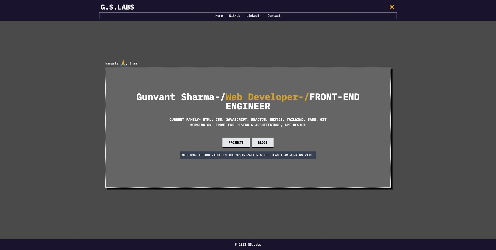
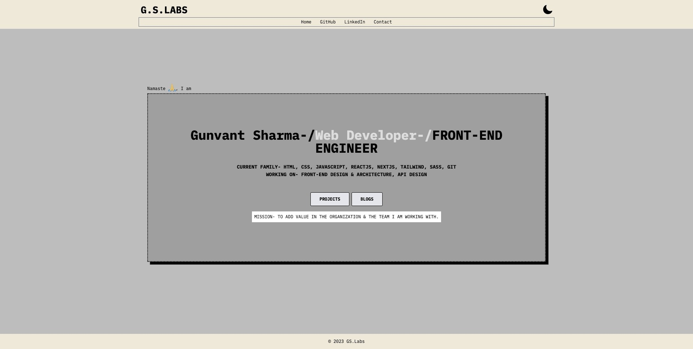
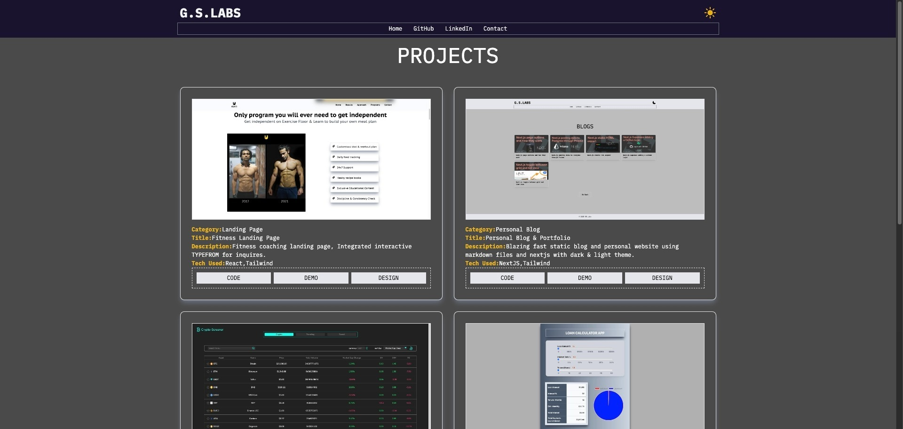
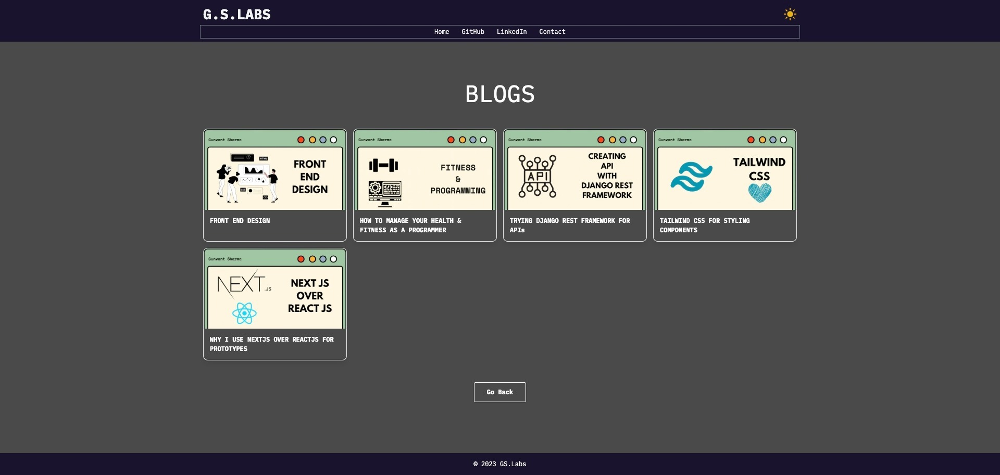
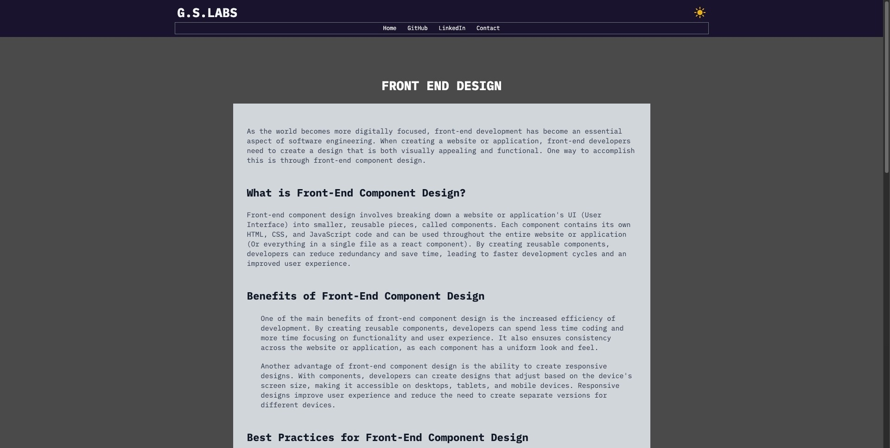

I created a simple minimal blog & portfolio website for myself using Next JS & Markdown files.
Website is statically generated by next js.

Technologies: NextJS, Tailwind CSS, Markdown

🚀🚀 [APP DEMO]

Design:

Screen Shots:

